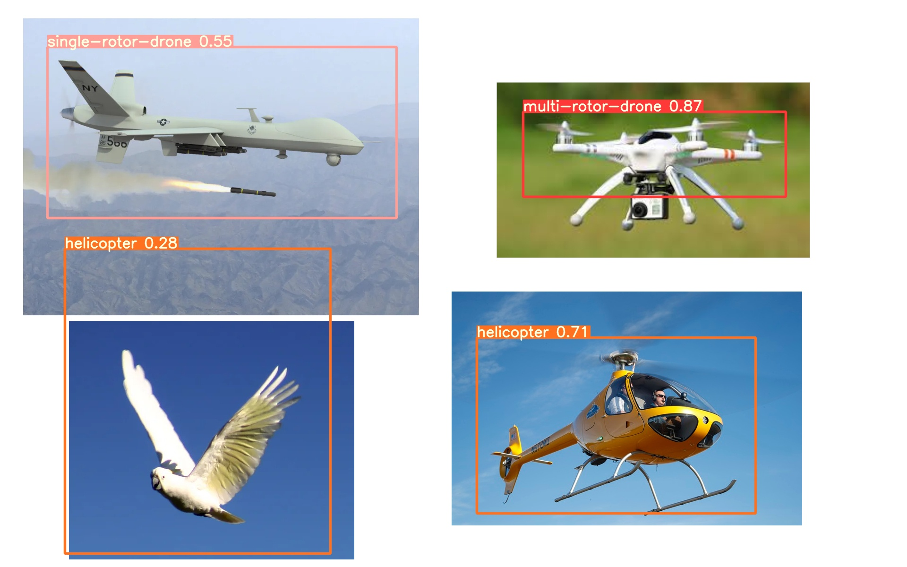

 This aerial object detection system uses YOLOv5 which is a family of object detection architectures and we have trained the model on self created dataset which uses publicly available images of drones, birds, and several other aerial objects.

  

 Check out <a href="https://github.com/ultralytics/yolov5">YOLOv5</a> for more information.

# Results:

## Overall detection

 
